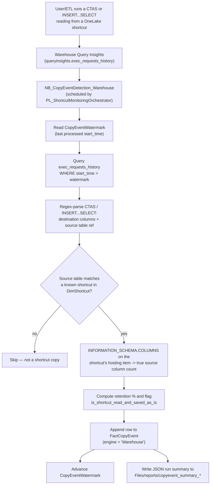
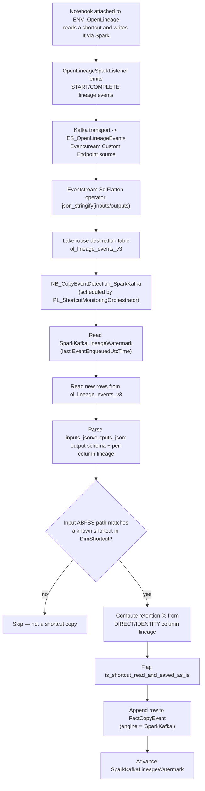

# Fabric Shortcuts Downstream Usage Monitoring

Microsoft Fabric solution that detects when a OneLake **shortcut** is read and then
**saved "as-is"** (copy/CTAS/INSERT-SELECT with no material transformation) by a
downstream Lakehouse or Warehouse item — and correlates that with native Spark/OpenLineage lineage
events. It flags duplicate shortcuts pointing at the
same source across the tenant.

See [`docs/architecture/Shortcut Monitoring Solution - Design Document.md`](docs/architecture/Shortcut%20Monitoring%20Solution%20-%20Design%20Document.md)
for the full design (architecture, data model, thresholds, rules), and
[`docs/data-model/Data Dictionary.md`](docs/data-model/Data%20Dictionary.md) for a full table-by-table,
column-by-column reference of every table/view in the solution's Lakehouse.

**Scope:** only the **Spark** and **Warehouse** copy-event engines are implemented. **Dataflow Gen2
detection is designed in the doc (§4.3) but not built** — planned for next version.

## How detection works

Two independent engines feed the same `FactCopyEvent` table, distinguished by `engine = 'Warehouse'`
vs. `engine = 'SparkKafka'`. See design doc §13.3/§13.4 for the full narrative behind each.

### Warehouse engine (`NB_CopyEventDetection_Warehouse`)



### Spark engine (`NB_CopyEventDetection_SparkKafka`)



## Repo layout

```
├── README.md
├── config/
│   └── config.example.json        # config.json schema doc (no secrets)
├── docs/
│   └── architecture/
│       └── Shortcut Monitoring Solution - Design Document.md
└── fabric/                        # Fabric-native items, grouped by type
    ├── notebooks/
    │   ├── NB_ShortcutInventory_DuplicateDetection.Notebook/
    │   ├── NB_CopyEventDetection_Warehouse.Notebook/
    │   ├── NB_CopyEventDetection_SparkKafka.Notebook/
    │   └── NB_OpenLineage_Validate.Notebook/
    ├── pipelines/
    │   └── PL_ShortcutMonitoringOrchestrator.DataPipeline/
    ├── environment/
    │   └── ENV_OpenLineage.Environment/
    ├── eventstreams/
    │   └── ES_OpenLineageEvents.Eventstream/
    ├── semanticmodels/
    │   └── SM_ShortcutMonitoring.SemanticModel/
    ├── reports/
    │   └── RPT_ShortcutMonitoring.Report/
    └── dataagents/
        └── DA_ShortcutMonitoring.DataAgent/
```

> **Fabric Git sync note:** each Fabric item folder (`<DisplayName>.<ItemType>`) must still sit
> directly inside the folder that the Fabric workspace's Git connection points at — Fabric mirrors
> folder structure 1:1 between the repo and the workspace. This repo's items were regrouped by type
> under `fabric/notebooks/`, `fabric/pipelines/`, `fabric/environment/`, `fabric/eventstreams/`,
> `fabric/semanticmodels/`, `fabric/reports/`, `fabric/dataagents/`; to keep the live `Shortcut
> Monitoring solution` workspace in sync, create matching folders inside that workspace folder, move
> each item into its corresponding folder there, then reconnect/sync — otherwise Git sync will show
> these items as moved/conflicting until the workspace side matches.

## Analytics layer (semantic model, report, Data Agent)

On top of the 4 tables produced by the notebooks, the repo also ships a ready-to-use analytics
layer — see the [Data Dictionary](docs/data-model/Data%20Dictionary.md) for full table/column
descriptions, all reused verbatim as the semantic model's own metadata:

| Item | Type | Purpose |
|---|---|---|
| `SM_ShortcutMonitoring.SemanticModel` | Semantic Model | **Direct Lake** model over `DimShortcut`, `FactCopyEvent`, `FactDuplicateShortcutGroup`, `FactShortcutInventoryDiff` — reads the Delta tables straight from OneLake (via the Lakehouse's own SQL analytics endpoint, using the `Sql.Database`-with-`mode: directLake` connector — the only Direct Lake source kind the Fabric engine accepts from a hand-authored `model.bim`; a generic `AzureStorage.DataLake(...)` M expression is rejected at import time even though it looks plausible). No import/refresh in the traditional sense. Each Fact table carries a real, materialized `shortcut_sk` column (written by the notebooks) so it can relate to `DimShortcut` on a real key (Direct Lake relationships can't use a calculated column as a join key). `vw_FactCopyEvent_SourceStatus`'s two enrichment values (`Source Shortcut Exists Now`, `Source Removed At`) are reproduced as measures on `FactCopyEvent` — the model uses **no calculated columns or calculated tables at all**, only sourced columns and ~25 measures (`Flagged Copy Events`, `Flagged %`, `Duplicate Groups`, `Net Shortcut Change`, `Group Member Count`, `Copy Event Detected At`, etc.). Every table/column carries the same description shown in the Data Dictionary, so Copilot/Q&A and the Data Agent can reason about them directly. |
| `RPT_ShortcutMonitoring.Report` | Report | Sample 4-page Power BI report bound to `SM_ShortcutMonitoring`: **Executive Summary** (KPI cards + trend), **Copy Events** (engine slicer, trend chart, detail table), **Duplicate Shortcuts** (severity breakdown, detail table), **Inventory & Churn** (added/removed trend, lifecycle table). |
| `DA_ShortcutMonitoring.DataAgent` | Data Agent | Natural-language Q&A agent bound to `SM_ShortcutMonitoring`, with `aiInstructions` covering all 3 areas (copy-event risk, duplicate-shortcut governance, inventory/churn) and 4 few-shot DAX examples. |

Because the semantic model lives in the same workspace as the Lakehouse, Direct Lake resolves
access via the workspace's own identity/SSO automatically — there's **no OAuth2 credential
binding to configure** (the "Data source credentials" option in the portal is disabled for this
kind of connection, which is expected, not an error). The only prerequisite is that the notebooks
(which write the `shortcut_sk` column) have already run at least once against
`LH_ShortcutMonitoring` so the Fact tables have that column populated; a brand-new deployment with
an empty Lakehouse — or an existing Lakehouse whose tables predate the `shortcut_sk` column — will
fail to refresh/frame until the next notebook run backfills it (each notebook run includes an
idempotent one-time migration guard that adds the column if it's missing and back-fills historical
rows from `DimShortcut`).

The generator scripts used to author these items (`scripts/gen_semantic_model.py`,
`scripts/gen_report.py`, `scripts/gen_data_agent.py`) and the generic deployer
(`scripts/deploy_item.ps1`) are kept in the repo so the analytics layer can be regenerated or
extended without hand-editing the underlying JSON.

## Item reference

| Item | Type | Purpose |
|---|---|---|
| `LH_ShortcutMonitoring` | Lakehouse | Hosts the solution's own config (`Files/config/config.json`), dimension/fact tables (`DimShortcut`, `FactShortcutInventoryDiff`, `FactDuplicateShortcutGroup`, `FactCopyEvent`), and error logs. |
| `NB_ShortcutInventory_DuplicateDetection.Notebook` | Notebook | Enumerates Lakehouse/Warehouse shortcuts across monitored workspaces via the monitoring service principal, upserts `DimShortcut`, computes shortcut add/remove lifecycle events, and flags duplicate shortcuts (same hosting item = High severity; same hosting workspace/different item = Medium; cross-workspace same-source is not flagged). |
| `NB_CopyEventDetection_Warehouse.Notebook` | Notebook | **Warehouse engine**. Mines Fabric Warehouse Query Insights (`exec_requests_history`) for CTAS/INSERT-SELECT statements sourced from a known shortcut and records them to `FactCopyEvent` (`engine = 'Warehouse'`). |
| `NB_CopyEventDetection_SparkKafka.Notebook` | Notebook | Kafka/Eventstream-based variant of the Spark copy-event rule; writes to `FactCopyEvent` with `engine = 'SparkKafka'`, fed by the `ES_OpenLineageEvents` Eventstream. |
| `NB_OpenLineage_Validate.Notebook` | Notebook | Validation notebook exercising a real shortcut read + save so the `ENV_OpenLineage` environment's `OpenLineageSparkListener` emits START/COMPLETE lineage events to the Kafka transport for testing. |
| `ENV_OpenLineage.Environment` | Environment | Spark environment with the OpenLineage listener configured, attached to the OpenLineage-instrumented notebooks. |
| `ES_OpenLineageEvents.Eventstream` | Eventstream | Ingests OpenLineage events (emitted by `ENV_OpenLineage`) for downstream copy-event correlation. |
| `PL_ShortcutMonitoringOrchestrator.DataPipeline` | Data Pipeline | Orchestrates the solution: runs `NB_ShortcutInventory_DuplicateDetection` first, then fans out to `NB_CopyEventDetection_Warehouse` and `NB_CopyEventDetection_SparkKafka` in parallel (each only does work if enabled in config). Has a 15-minute Cron schedule, **created disabled** — enable it in the Fabric portal (Settings → Schedule) once the solution is validated. |

## Configuration (`config.json`)

Each notebook reads `Files/config/config.json` from its own attached `LH_ShortcutMonitoring`
Lakehouse at runtime (resolved dynamically via `notebookutils.runtime.context`, so no workspace/
lakehouse IDs are hardcoded in the notebooks — reattaching to a different Lakehouse/workspace is
enough to retarget the whole solution). See [`config/config.example.json`](config/config.example.json) for the
full schema (**not** the live file — the real `config.json` with the live secret lives only in the
deployed Lakehouse, never in this repo). Key sections:

| Section | Purpose |
|---|---|
| `monitoredWorkspaces` | List of `{workspaceName, workspaceId}` — the workspaces scanned for shortcuts/copy events. Edit this to add/remove workspaces from monitoring without touching any notebook code. |
| `detection.columnRetentionThresholdPercent` | The "saved as-is" column-retention threshold used by both copy-event engines. |
| `detection.excludeWarehouseNamePatterns` | Auto-generated Dataflow staging warehouses to ignore during Warehouse-engine detection. |
| `orchestration.enabledEngines` | `["warehouse", "sparkKafka"]` by default — lets you disable an engine (e.g. no Eventstream wired up in a dev workspace) purely via config; the pipeline still calls both notebooks every run, and a disabled notebook exits immediately without doing work. |
| `auth` | Service principal `tenantId`/`clientId`/`clientSecret` used for Fabric Admin REST API calls. **`clientSecret` is entered manually into the deployed `config.json` on OneLake — it is plaintext, not Key Vault-backed.** This was a deliberate, temporary simplification; revisit before wider production rollout. |

Note: run **cadence** (how often the pipeline fires) is controlled solely by the Data Pipeline's own
schedule trigger — there is no `polling.*` config section, since a config value inside a notebook
can't retroactively change a platform-level schedule that already decided to run it.

## Building the `ENV_OpenLineage` environment (Spark + Kafka secret)

`ENV_OpenLineage.Environment/Setting/Sparkcompute.yml` configures the Spark environment attached to
the OpenLineage-instrumented notebooks (`NB_OpenLineage_Validate`, `NB_CopyEventDetection_SparkKafka`).
To rebuild it from scratch (or verify an existing one):

1. **Spark library:** add `io.openlineage:openlineage-spark_2.12:1.53.0` (or current version) as a
   Maven/public library in the environment's **Libraries** tab, so `OpenLineageSparkListener` is on
   the classpath.
2. **Spark configuration (`spark_conf`)**, set under the environment's **Spark compute** tab:

   | Key | Value | Purpose |
   |---|---|---|
   | `spark.extraListeners` | `io.openlineage.spark.agent.OpenLineageSparkListener` | Registers the listener that emits lineage events for every Spark read/write. |
   | `spark.openlineage.transport.type` | `kafka` | Send events to the `ES_OpenLineageEvents` Eventstream's Kafka-compatible custom endpoint. |
   | `spark.openlineage.transport.topicName` | the Eventstream custom endpoint's topic name | From the Eventstream's Details pane (Kafka tab). |
   | `spark.openlineage.transport.properties.bootstrap.servers` | the Eventstream custom endpoint's bootstrap server, e.g. `<endpoint>.servicebus.windows.net:9093` | From the same Details pane. |
   | `spark.openlineage.transport.properties.security.protocol` | `SASL_SSL` | Required by the Kafka-compatible endpoint. |
   | `spark.openlineage.transport.properties.sasl.mechanism` | `PLAIN` | SAS-key auth (see the security note below for an Entra ID alternative). |
   | `spark.openlineage.transport.properties.key.serializer` / `.value.serializer` | `org.apache.kafka.common.serialization.StringSerializer` | Standard Kafka string serializers. |
   | `spark.openlineage.namespace` | any short identifier, e.g. `shortcut_monitoring` | Tags emitted events for this solution. |
   | `spark.jars.packages` | `io.openlineage:openlineage-spark_2.12:1.53.0` | Belt-and-suspenders alongside the Libraries tab. |
   | `spark.openlineage.transport.properties.sasl.jaas.config` | **secret — see below** | Kafka SASL PLAIN credential. |

3. **Getting/rotating the Kafka secret:** the Custom Endpoint source on `ES_OpenLineageEvents`
   (`OpenLineageCustomEndpoint`) is a Fabric-managed, Kafka-compatible ingestion endpoint — it is
   **not** a separate Azure resource in your subscription; it only exists inside this Eventstream
   item. Get (or regenerate) its connection string from the Fabric portal: open `ES_OpenLineageEvents`
   → select the `OpenLineageCustomEndpoint` source node → **Details** pane → **Kafka** tab → copy the
   connection string (or click regenerate for a new key). Build the JAAS config string as:

   ```
   org.apache.kafka.common.security.plain.PlainLoginModule required username="$ConnectionString" password="<paste the Kafka connection string here>";
   ```

   **Never commit the real value.** `Sparkcompute.yml` in this repo only ever contains a placeholder value — paste the real value directly into the environment's
   Spark compute settings in the Fabric portal after deployment, exactly like `config.json`'s
   `clientSecret` (see Configuration above). This is the same deliberate, temporary plaintext-secret
   simplification as `clientSecret`; a hardened version would use Entra ID / OAuthBearer auth against
   the custom endpoint instead of a SAS-key JAAS config (see
   [Connect to Eventstream using Microsoft Entra ID authentication](https://learn.microsoft.com/en-us/fabric/real-time-intelligence/event-streams/custom-endpoint-entra-id-auth)),
   removing the need to store any Kafka credential at all.

> **If this key is ever accidentally committed:** treat it as compromised immediately — regenerate it
> from the Details pane above (this invalidates the old key) — and if it was pushed to a remote,
> scrub it from git history (e.g. `git filter-repo`) and force-push, in addition to rotating it.

4. **Where the emitted events end up, and what permissions that needs:** every monitored notebook's
   OpenLineage events land in ONE shared table — `ol_lineage_events_v3` in `LH_ShortcutMonitoring`,
   inside the monitoring workspace (`WS_SagarFabric01`) — regardless of which workspace the emitting
   notebook itself runs in. Two independent permission boundaries apply, and the common assumption
   ("does every monitored workspace need write access to the monitoring workspace?") is **no**:
   - **Notebook → Eventstream (producer side):** a monitored notebook only needs the Kafka SASL
     connection string above to publish as a Kafka producer to the `OpenLineageCustomEndpoint` source.
     This is a network/credential-based Kafka auth, unrelated to the notebook's own workspace's Fabric
     RBAC permissions.
   - **Eventstream → Lakehouse (destination side):** `ES_OpenLineageEvents`'s Lakehouse destination
     (`eventstream.json`) points directly at `LH_ShortcutMonitoring` via `workspaceId`/`itemId`. That
     write permission was granted **once**, when the destination was configured in the Fabric portal
     (its "Get data"-style destination wizard) — it's baked into the Eventstream item itself and is
     never re-evaluated per producing notebook/workspace.

   So the only thing to distribute per monitored workspace is the Kafka secret into that workspace's
   `ENV_OpenLineage` environment — no cross-workspace Fabric item permissions need to be granted.

## Prerequisites

- A Microsoft Fabric workspace (capacity must be running) with a monitoring service principal (SP)
  granted read access to all monitored workspaces. The SP must be added as **at least a Viewer** on
  every workspace listed in `config.monitoredWorkspaces` — this can only be done by that workspace's
  own admin/owner, not by this solution's deployment script, since it requires access the deployer may
  not have over other teams' workspaces. Concretely, the SP's token is used two ways per monitored
  workspace: (1) `GET /v1/workspaces/{id}/items` and `.../warehouses/{id}` (Fabric REST API — Viewer
  role is sufficient) to enumerate shortcuts/Warehouses, and (2) a direct AAD-token JDBC connection to
  each Warehouse's SQL analytics endpoint to query `queryinsights.exec_requests_history` (Warehouse
  copy-event engine only) — Viewer's default SQL mapping is normally enough, but if a workspace has
  locked-down Warehouse-level SQL security beyond the default role mapping, its owner may also need to
  run `CREATE USER [<sp-name>] FROM EXTERNAL PROVIDER` + `GRANT SELECT` explicitly in that Warehouse.
- `config.json` deployed to `LH_ShortcutMonitoring/Files/config/config.json` with the monitored
  workspace list, detection thresholds, and the service principal's `clientSecret` filled in
  manually (see `config.example.json`).
- The `ENV_OpenLineage` environment built and its Kafka secret populated manually (see **Building the
  `ENV_OpenLineage` environment** above), **and explicitly attached as the Spark session environment**
  on `NB_OpenLineage_Validate.Notebook` and `NB_CopyEventDetection_SparkKafka.Notebook` (notebook →
  **Environment** dropdown in the top toolbar) — if you plan to use the Spark/OpenLineage copy-event
  engine. Fabric notebooks don't inherit a workspace-default environment automatically for this
  purpose; without this environment attached, `OpenLineageSparkListener` never loads, no events reach
  Kafka, and the Spark engine silently detects nothing.
- At least one existing OneLake **shortcut** in a monitored workspace that has already been read and
  saved as-is (via Spark or Warehouse) — this is what the copy-event engines actually detect. If you
  don't already have such a scenario to test against, see **Optional: simulate a test scenario** below.

### Optional: simulate a test scenario

If no shortcut read + save-as-is has happened yet in a monitored workspace, you can manufacture one
per engine so you have something for the detection notebooks to find:

- **Spark engine:** run `fabric/notebooks/NB_OpenLineage_Validate.Notebook`. It reads an existing
  OneLake shortcut and writes it out unmodified via Spark, which is exactly the "read and saved as-is"
  pattern the Spark/OpenLineage-based engine (`NB_CopyEventDetection_SparkKafka`) looks for. Update the
  hardcoded source shortcut path in its first cell to point at a real shortcut in your tenant before
  running.
- **Warehouse engine:** open the SQL query editor against a monitored Warehouse (that hosts, or has a
  shortcut to, a source table) and run a CTAS statement reading straight from the shortcut with no
  column reduction, e.g.:

  ```sql
  CREATE TABLE dbo.wh_validate_shortcut_copy
  AS
  SELECT * FROM dbo.<your_shortcut_table_name>;
  ```

  This is a genuine "read and saved as-is" copy — it will show up in that Warehouse's Query Insights
  (`queryinsights.exec_requests_history`) as a `CREATE TABLE AS SELECT`, which `NB_CopyEventDetection_Warehouse`
  picks up on its next run. Replace `dbo.<your_shortcut_table_name>` with the actual schema/name of the
  shortcut table, and drop `dbo.wh_validate_shortcut_copy` afterward if you don't want to keep the test
  artifact around.

## Deployment

### Option A (recommended for a quick/fresh install): `deploy/Deploy-ShortcutMonitoring.ps1`

A single config-driven PowerShell script deploys every artifact into a target workspace, in
dependency order, with a verification check after each step - no Git integration required.

1. `cd deploy`, copy `deploy.config.example.json` to `deploy.config.json`, and fill in your
   target `workspace.id` (or `workspace.createIfMissing`/`capacityId` to create a new one),
   `monitoredWorkspaces`, and `auth.tenantId`/`auth.clientId` (the monitoring SP — see **Prerequisites**
   above for the access it needs on each monitored workspace). Never commit this file (it's
   git-ignored) or put a secret in it — the script prompts for the SP's `clientSecret` interactively.
2. Run `az login` if you haven't already, then:
   ```powershell
   .\Deploy-ShortcutMonitoring.ps1 -ConfigPath .\deploy.config.json
   ```
3. The script runs 12 steps (workspace → folders → Lakehouse → config.json upload → Environment →
   Eventstream → Notebooks → Pipeline → an initial pipeline run to seed the Fact/Dim tables →
   Semantic Model → Report → Data Agent), printing an `[OK]` verification line after each one, and
   persists resolved item ids to `.deploy-state.<workspaceId>.json` so re-runs update items in place
   instead of recreating them.
4. If a step fails, the script prints the exact `-SkipSteps` value to resume from where it stopped,
   e.g.:
   ```powershell
   .\Deploy-ShortcutMonitoring.ps1 -ConfigPath .\deploy.config.json -SkipSteps 1,2,3,4,5,6,7,8,9
   ```
5. Two things the script deliberately does **not** automate (Fabric has no definition-API surface for
   either): populating the `ENV_OpenLineage` environment's Kafka secret (see **Building the
   `ENV_OpenLineage` environment** below), and attaching that environment to
   `NB_OpenLineage_Validate.Notebook`/`NB_CopyEventDetection_SparkKafka.Notebook` in the portal's
   notebook **Environment** dropdown. The script prints a reminder for both after step 5.
6. `fabric/**` is the templated source of truth for this script - `deploy/parameters.json`
   lists every literal value (workspace id, lakehouse id, SQL endpoint, notebook ids, semantic model
   id) it substitutes per item before upload. If you hand-edit an item's files directly in this repo
   with a *new* hardcoded id, add a matching token entry there too.

### Option B: Fabric Git integration (used to build this solution)

Connect the target Fabric workspace directly to this repo (or a branch/fork of it) so items sync
in both directions through the Fabric portal — this is how the items in this repo were originally
authored and kept in sync.

1. Follow [Get started with Git integration](https://learn.microsoft.com/en-us/fabric/cicd/git-integration/git-get-started)
   to connect the workspace (Workspace settings → Git integration), pointing the connection at the
   folder in this repo containing the `fabric/` item folders (see the Fabric Git sync note above —
   the workspace's own folder structure must mirror `fabric/notebooks/`, `fabric/pipelines/`,
   `fabric/environment/`, `fabric/eventstreams/`).
2. Sync from Git into the workspace.
3. Attach the notebooks to `LH_ShortcutMonitoring`, populate `config.json`, and enable
   `PL_ShortcutMonitoringOrchestrator`'s schedule (Fabric portal → pipeline → Settings → Schedule)
   once validated.

### Option C: CI/CD via the Fabric REST API / `fabric-cicd`

For CI/CD (GitHub Actions/Azure DevOps) or environments where a live Git-connected workspace isn't
practical, deploy the same item folders programmatically instead of through the portal's Git pane:

- **[`fabric-cicd`](https://github.com/microsoft/fabric-cicd)** — Microsoft's open-source Python
  library purpose-built for this: point it at a workspace ID and this repo's `fabric/` directory and
  it publishes (or removes orphaned) Notebook/DataPipeline/Environment/Eventstream items directly via
  the Fabric REST API, with YAML-based parameterization for per-environment values (dev/test/prod
  workspace IDs, connection strings, etc.). See the
  [tutorial](https://learn.microsoft.com/en-us/fabric/cicd/tutorial-fabric-cicd-local) for a working
  example, and the [official CI/CD article](https://learn.microsoft.com/en-us/rest/api/fabric/articles/fabric-ci-cd) for how it relates to the raw Items/Folders REST APIs.
- **Raw Fabric REST API** — the same approach used to build this solution's pipeline/folders in this
  session: authenticate (Azure CLI / service principal token for `https://api.fabric.microsoft.com`),
  then call the [Items](https://learn.microsoft.com/en-us/rest/api/fabric/core/items) and
  [Folders](https://learn.microsoft.com/en-us/rest/api/fabric/core/folders) APIs directly
  (create/update item definitions, create folders, move items) from a script — more control, more
  boilerplate than `fabric-cicd`, useful for one-off automation or when you need something the
  library doesn't yet support.
- **Fabric Deployment Pipelines** — once the solution is deployed once, Fabric's built-in
  [deployment pipelines](https://learn.microsoft.com/en-us/fabric/cicd/deployment-pipelines/intro-to-deployment-pipelines)
  feature can promote it across Dev → Test → Prod workspaces with environment-specific rules, as an
  alternative/complement to re-running Git sync or `fabric-cicd` per environment.

### Deploying/updating the semantic model, report, and Data Agent

`SM_ShortcutMonitoring.SemanticModel`, `RPT_ShortcutMonitoring.Report`, and
`DA_ShortcutMonitoring.DataAgent` were authored and are redeployed using `scripts/deploy_item.ps1`
(a thin wrapper over the Fabric Items REST API), not Git sync — this keeps the workflow scriptable
and lets the model.bim/report/data-agent JSON be regenerated from `scripts/gen_semantic_model.py`,
`scripts/gen_report.py`, `scripts/gen_data_agent.py` when the generator source changes.

**Update an existing item in place** (most common case — e.g. after editing `gen_semantic_model.py`
and regenerating `model.bim`):

```powershell
.\scripts\deploy_item.ps1 -SourceDir "fabric\semanticmodels\SM_ShortcutMonitoring.SemanticModel" -ExistingItemId "<item-guid>"
```

Same pattern for the report (`fabric\reports\RPT_ShortcutMonitoring.Report`) and Data Agent
(`fabric\dataagents\DA_ShortcutMonitoring.DataAgent`). Find an item's GUID via
`GET /v1/workspaces/{workspaceId}/items` (filter on `displayName`) if you don't already have it.

**Create a brand-new item** (first-time deploy, or when in-place update isn't supported — see
caveats below): omit `-ExistingItemId`. The script then `POST`s to
`/v1/workspaces/{workspaceId}/items` instead of `updateDefinition`, and Fabric assigns a new item
GUID. After creating a new semantic model this way, you must **repoint every dependent item** to
its new GUID before redeploying them:
- `fabric/reports/RPT_ShortcutMonitoring.Report/definition.pbir` → `datasetReference.byConnection.connectionString`'s `semanticmodelid=...`
- `fabric/dataagents/DA_ShortcutMonitoring.DataAgent/Files/Config/draft/semantic_model-SM_ShortcutMonitoring/datasource.json` → `artifactId`

**Two important caveats learned the hard way while building this solution:**

1. **Converting an Import/DirectQuery semantic model to Direct Lake in place is not supported** by
   `updateDefinition` — it fails with *"Converting existing tables or partitions from Import or
   DirectQuery mode to Direct Lake is not supported."* You must delete the old semantic model item
   and create a fresh one (new GUID), then repoint the report/Data Agent as above.
2. **A report referencing a shared theme by name (`themeCollection.baseTheme`) must also ship the
   actual theme JSON file** under `StaticResources/SharedResources/BaseThemes/<ThemeName>.json`
   *and* a matching `resourcePackages` entry in `report.json` — a `model.bim`/report deploy that
   only sets the theme name (no embedded file, no `resourcePackages`) is accepted by the API with
   no error, but the report then hangs on a **blank screen with no error message** when opened in
   the browser, because the client can't resolve the theme resource. `scripts/gen_report.py`
   embeds `scripts/theme_CY24SU10.json` for exactly this reason — if you change themes, copy the
   new theme's JSON alongside it and update `THEME_NAME` in the generator.
